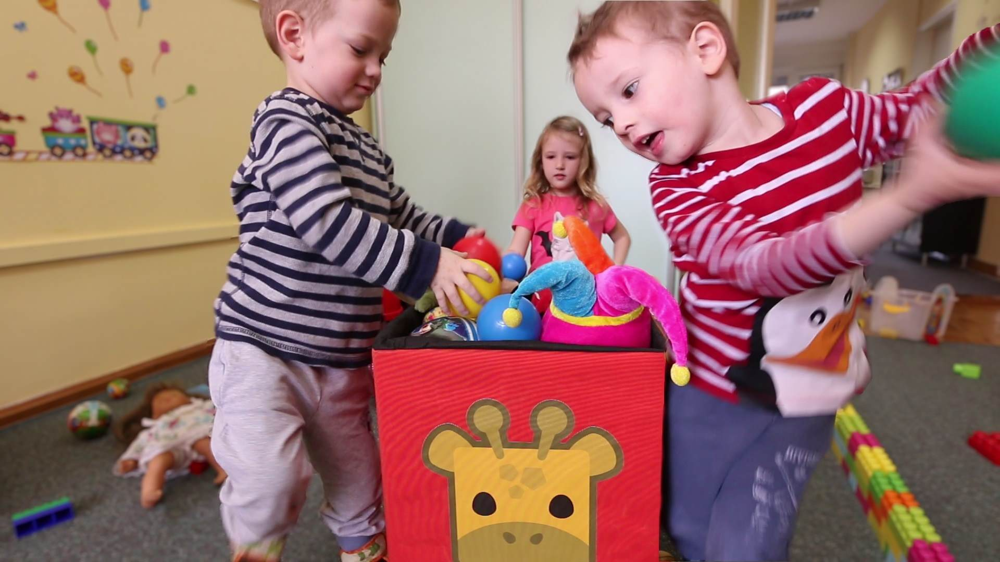

Smart Toybox
============

Smart Toybox is a hardware device that solves problem most parents have - toys all over the house - by making cleaning-up the toys FUN!

This repository contains Smart Toybox embedded software for Smart Toybox prototype based on TI cc3200 platform.

Requirements
------------
This software require previously built hardware.

How to build it
---------------
We recomend using TI CCS edition that is freely available for cc3200 platform. Instalation manual is available
with cc3200 evaluation board used as platform for hardware and it is assumed that you already installed and
configured CCS for cc3200. You will also need TI's Uniflash tool.

1.  Create new CCS empty project named smarttoybox. Select target cc3200.
2.  Clone repo into created project folder.
    > Searching for better solution because this way whenever important change is made in project
    > it needs to be propagated to project files in ccs directory.
    > Also when change comes via source control, ccs dir content needs to be copied back to project root dir.
3.  For the first run, you will have to calibrate software for your sensor.
    Build solution and run it from CCS (with console output) so you can see calibration messages and results.
5.  Edit settings.ini file in deploy/uniflash_config_session/fileSystem directory with data gathered in calibration.
6.  Turn off calibration by commenting out #define CALIBRATION in common.h
7.  (optional) customize theme using Theme Packer. You can find theme.stb file in
    deploy/uniflash_config_session/fileSystem directory.
8.  Use TI's Uniflash tool to setup device using uniflash_config.usf file in deploy directory.
9.  Build software again. After setting up you can remove SOP jumper from cc3200 board, connect power
    bank and have FUN!

Additional Open Source code included
------------------------------------

We are using (slightly modified to compile and work on two channels) WavPack integer-based decompression
code called Tiny Decoder, hardware-friendly decoder by David Bryant.

You can find original code [here: http://wavpack.com/](http://wavpack.com/)
